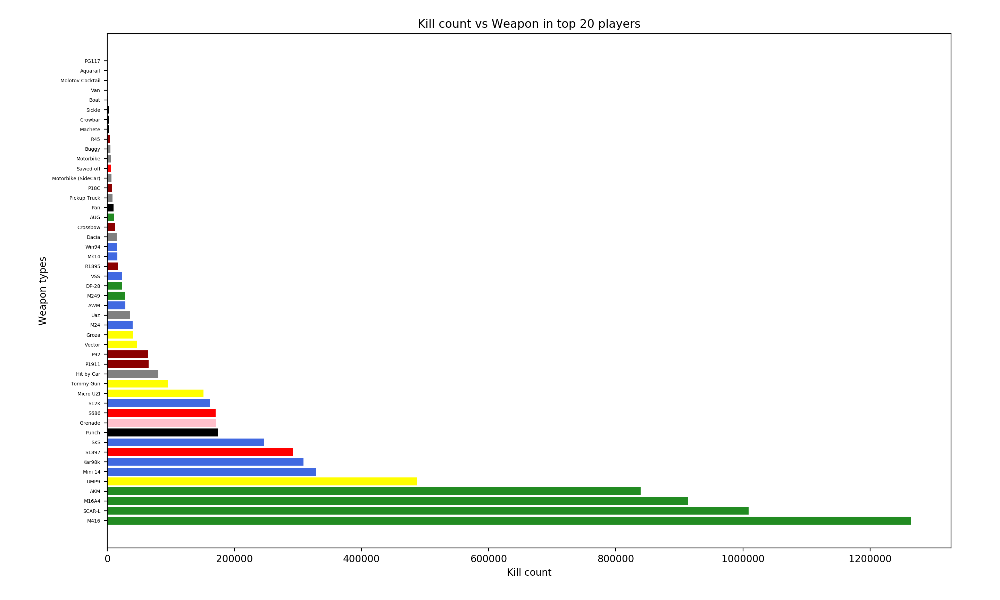
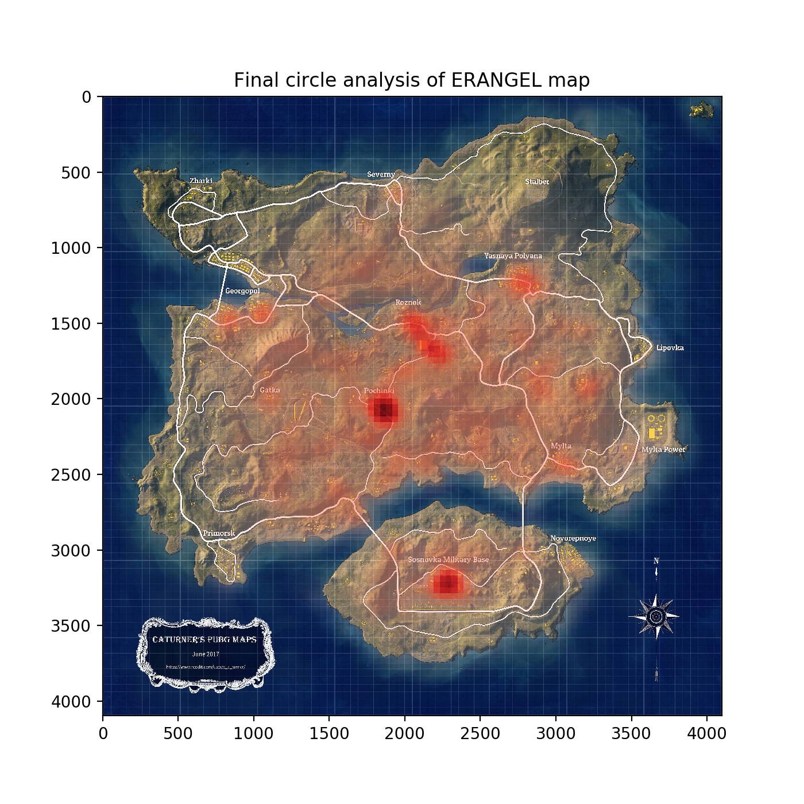
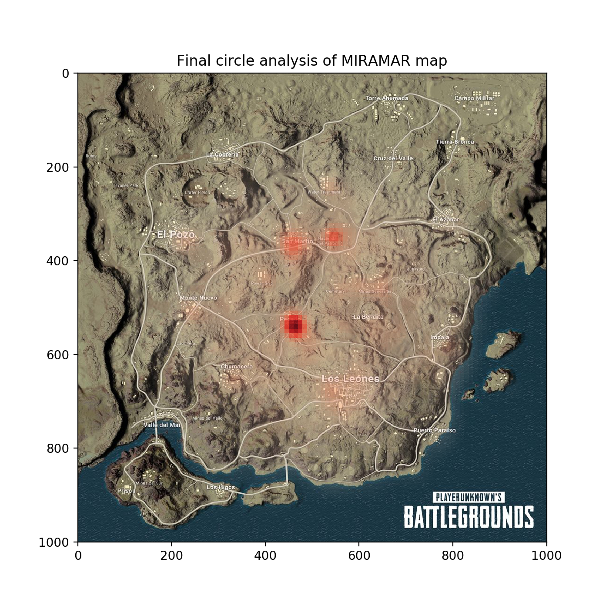
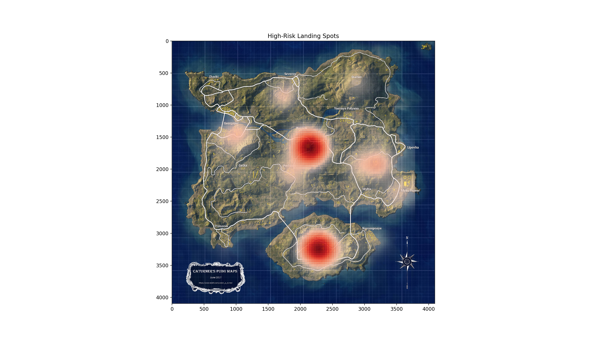
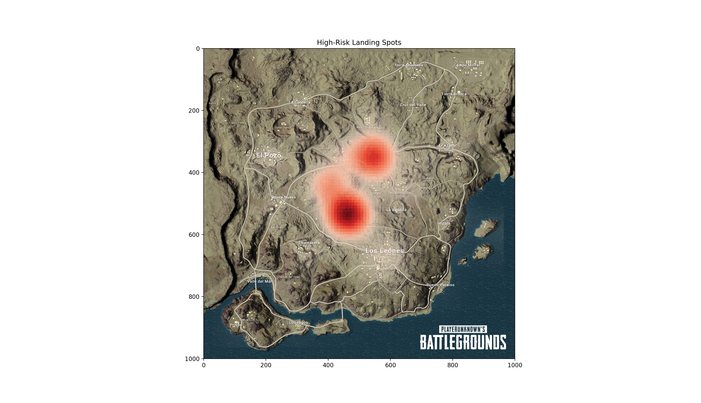
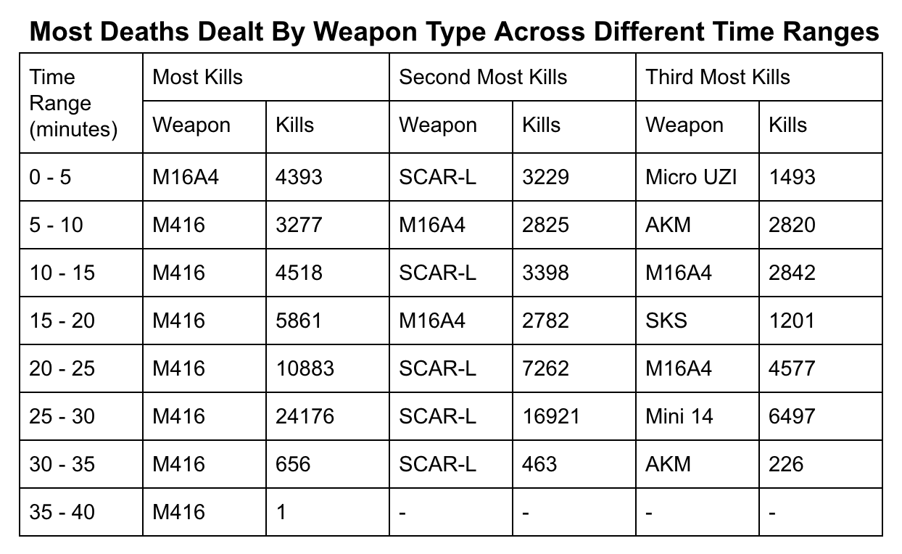

# Data-mining-project [](http://hits.dwyl.io/LeviIsAwesome/https://github.com/LeviIsAwesome/Pubg-Game-Mining)
A PUBG [(wiki page)](https://en.wikipedia.org/wiki/PlayerUnknown%27s_Battlegrounds) game data mining project that focus on giving player intuition of how to survive longer and have a better chance to win the game.

## Contributing  [](#contributors)
The project was for the final case study of a __Fourth Year Level Course: Data Mining__, and the main contributors were (names in alphabetical order):

| [<br /><sub><b>Levi Guo</b></sub>](https://github.com/LeviIsAwesome)  | [<br /><sub><b>Timothy Levins</b></sub>](https://github.com/timsnetL)  |[<br /><sub><b>Minghao Li</b></sub>](https://github.com/MingoLi)  | [<br /><sub><b>Yibin Zhang</b></sub>](https://github.com/YibinZhang1202)  |  
|---|---|---|---|


## Dataset
Download the [PUBG Match Deaths and Statistics](https://www.kaggle.com/skihikingkevin/pubg-match-deaths/data) dataset from Kaggle to the current directory.

## Contribution

### 1. Go offensive or deffensive
This contribution is discussing about whether actively attaching or hiding would lead to a winning situation.

```
# Running the code in terminal by typing:
python offensive_vs_deffensive.py
```

  
This code group the factor of "player_kills" and "won" the game together to see the correlation between how many people the player killed and won the game.
```
agg0.loc[agg0['player_kills'] < 45, ['player_kills', 'won']].groupby('player_kills')
```

### 2. Go solo or collaborate
This contribution discusses about whether go solo or collaborate in the group game mode would lead to a winning situation.

```
# Running the code in terminal by typing:
python solo_vs_collaborate.py
```

 This code group the factor of "play assists" and "won" the game together with party size greater than 1 which is group game mode
```
agg0.loc[agg0['party_size'] != 1, ['player_assists', 'won']].groupby('player_assists')
```

### 3. Best weapon to use
  Mining the weapons choosed by top 20 players in each game, which contributes the decision making on weapon choice. The color of the bar in the chart shows the attack range of the weapon, where the hotter colors represent the shorter range, the colder colors represent the longer range.
  <br />
  The pre-processing cleans up all death caused by accident. Then, valid records are collected.
  
  ```
  # Please place the file 'kill_match_stats_final_0.csv' at the same folder as best_weapon.py
  # Running the code in terminal by typing:
  python3 best_weapon.py
  ```
  
  
  
### 4. Final circle analysis
  We mine the final locations of the winner (1st player) in each game. This reflects the locations of the final circle.
  Since the final circle (final safety area) is not randomly generated by the system. It tends to be generated in the area with the least survivors. Therefore, this mining reflects the players' behavior pattern. It answers the questions: "which area players less possible to hide?" and "which area is the most safety for us to go?"
  
  ```
  # Please place the file 'kill_match_stats_final_0.csv' at the same folder as best_weapon.py
  # Running the code in terminal by typing:
  python3 final_circle_analysis.py ERANGEL
  or
  python3 final_circle_analysis.py MIRAMAR
  where ERANGEL and MIRAMAR are two maps in the game.
  ```
   
   
   
### 5. High-risk landing zone analysis
  At the start of the game, players get to choose their starting/landing position. To determine high risk landing zones, we mine all the locations where players die within the first 2 minutes of the game. We use a heapmap to visualize the player deaths density on the given maps.
  
  Refer to `highriskspot.py` for code.
  
  Here we explore 2 maps:
  
  Map1 : ERANGLE
   
   
  Map 2 : MIRAMAR
   

### 6. Highest Deaths Dealt by Weapon Types Across Different Time Windows
  Here we mine the hishest deaths dealt by weapon type across 5 minute time windows throughout entire matches. As the game progresses, the safe roaming zone decreases in size and this bring players closer together. Analysing this data may give the player good insight for weapon selection during different times in the game.
  
  Refer to `weaponByTime.py` for code.
   
   
### 7. Weapon choice sequential mining
  We mine the weapons sequence used by the winner (1st player) in each game. This helps the the decision making on weapon choice that related to the game timing. We can obtain the optimized weapon strategies at different stages of the game from the result.

  The pre-processing cleans up all death caused by accident. Then, valid records are collected.
  The algorithms collects all the weapons used by the winner (1st player) in each game. The data is stored in a sorted list which sorted by the victim's rank in that game. Then, the adjacent kills with the same weapon are merged. Finally, a valid weapon sequence is generated.
 
 ```
  # Please place the file 'kill_match_stats_final_0.csv' at the same folder as weapon_sequential_mining.py
  # Running the code in terminal by typing:
  python3 final_circle_analysis.py 500
  where the argument 500 is the minimum support. 
  ```
  Sample output:
  
  ```
  All frequent sequence for weapon with minsup = 500

  <M416 Kar98k M416>: 999
  <M416>: 5093
  <M16A4>: 1973
  <SCAR-L>: 3402
  <SCAR-L M416>: 962
  <SCAR-L Kar98k SCAR-L>: 657
  <M16A4 SCAR-L>: 693
  <AKM SCAR-L>: 567
  <AKM M416>: 981
  <Kar98k M416>: 551
  <M16A4 M416>: 943
  <Mini 14 M416>: 502
  <UMP9 M416>: 555
  <AKM>: 1575
  <M416 SCAR-L>: 530
  ```
