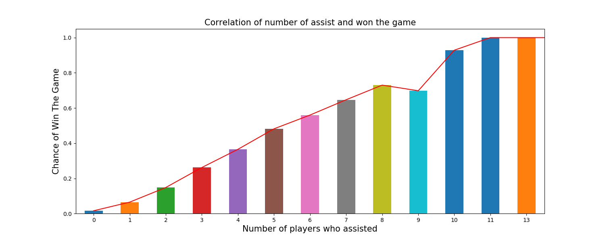

# Data-mining-project
A PUBG [(wiki page)](https://en.wikipedia.org/wiki/PlayerUnknown%27s_Battlegrounds) game data mining project that focus on giving player intuition of how to survive longer and have a better chance to win the game.

## Dataset
Download the dataset from Kaggle to current directory at: [PUBG Match Deaths and Statistics](https://www.kaggle.com/skihikingkevin/pubg-match-deaths/data).

## Contribution

### 1. Go offensive or defensive
This contribution discusses about whether actively attaching or hiding would lead to a winning situation.

```
# Running the code in terminal by typing:
python offensive_vs_deffensive.py
```


This code group the factor of "player_kills" and "won" the game together to see the correlation between how many people the player killed and won the game.
```
agg0.loc[agg0['player_kills'] < 45, ['player_kills', 'won']].groupby('player_kills')
```
  
### 2. Go solo or collaborate
This contribution discusses about whether go solo or collaborate in the group game mode would lead to a winning situation.
```
# Running the code in terminal by typing:
python solo_vs_collaborate.py
```


This code group the factor of "play assists" and "won" the game together with party size greater than 1 which is group game mode
```
agg0.loc[agg0['party_size'] != 1, ['player_assists', 'won']].groupby('player_assists').won.mean().
```

### 3. Best weapon to use
  Mining the weapons choosed by top 20 players in each game.
  
  ```
  # Please place the file 'kill_match_stats_final_0.csv' at the same folder as best_weapon.py
  # Running the code in terminal by typing:
  python best_weapon.py
  ```
  
  
